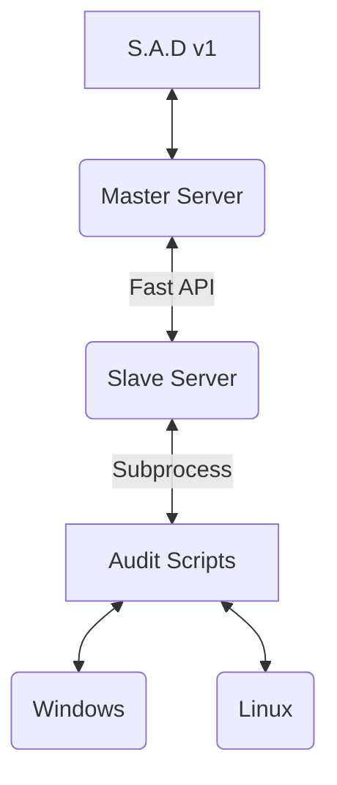

# <u>S.A.D-v1</u>
## **S**ecurity **A**udit **D**ashboard : v1
A Basic Security audit dasboard for endpoint devices made in python with web interface

# Working:


# File Structure (Windows):
```
Master File Structure:
|-- static
      |-- arf.css
      |-- arf.js
      |-- d3.v3.min.js
      |-- index.html
 |-- master.py

Slave File Structure:
      |-- slave.py
      |-- audity.py
```
# Required Libraries:
```
pip install fastapi
pip install uvicorn[standard]
pip install wmi
pip install json
pip install reportlab
pop install fpdf
pip install httpx
```

